# AWS Serverless NLP Comprehend using AWS CDK

 This repository describes how to design and implement Natural Language Processing(NLP)-based service using AWS Serverless, Amazon Comprehend and AWS Cloud Development Kit(CDK). This sample specifically illustrates a real-time user review analysis system as an example. All resources and configuration is provided through AWS CDK(typescript codes).

## Solution

[Amazon Comprehend](https://aws.amazon.com/comprehend) provides a various solution(APIs) to analyze text within document. If we use this to build `Review Analysis System`, we can get very easy, fast and high-accuracy AI features. Particulary, If we provide real-time analysis, a combination of [AWS CDK](https://aws.amazon.com/cdk) and [AWS Serverless](https://aws.amazon.com/serverless) can make this easier. AWS Serverless can be used in a wide variety of fields from web development to data processing, and configuring and deploying these as IaC(AWS CDK) can maximize development productivity.

### Amazon Comprehend

 The following features in Amazon Comprehend were applied.

* [Sentiment Analysis](https://boto3.amazonaws.com/v1/documentation/api/latest/reference/services/comprehend.html#Comprehend.Client.detect_sentiment)
* [Entities Analysis](https://boto3.amazonaws.com/v1/documentation/api/latest/reference/services/comprehend.html#Comprehend.Client.batch_detect_entities)
* [Syntax Analysis](https://boto3.amazonaws.com/v1/documentation/api/latest/reference/services/comprehend.html#Comprehend.Client.batch_detect_sentiment)

### AWS Serverless

The following services in AWS Serverless were applied.

* [AWS Lambda](https://aws.amazon.com/lambda)
* [Amazon S3](https://aws.amazon.com/s3/)
* [Amazon DynamoDB](https://aws.amazon.com/dynamodb)
* [Amazon Kinesis](https://aws.amazon.com/kinesis)
* [Amazon API Gateway](https://aws.amazon.com/api-gateway)
* [AWS Glue](https://aws.amazon.com/glue)
* [Amazon Athena](https://aws.amazon.com/athena)
* [Amazon QuickSight](https://aws.amazon.com/quicksight)

### AWS CDK

The following AWS CDK-related open sources were applied.

* [AWS CDK](https://aws.amazon.com/cdk)
* [AWS Solutions Constructs](https://docs.aws.amazon.com/solutions/latest/constructs/welcome.html)
* [AWS CDK Project Customization Template](https://github.com/aws-samples/aws-cdk-project-template-for-devops)

## Architecture

This architecture covers the following features.

* Serverless Realtime Review API Service
* Serverless Realtime Review Sentiment Analysis
* Serverless Review Entity/Syntax Stream-Batch Analysis
* Serverless Near Realtime Data Processing & Visualization
* Serverless System Monitoring Dashboard

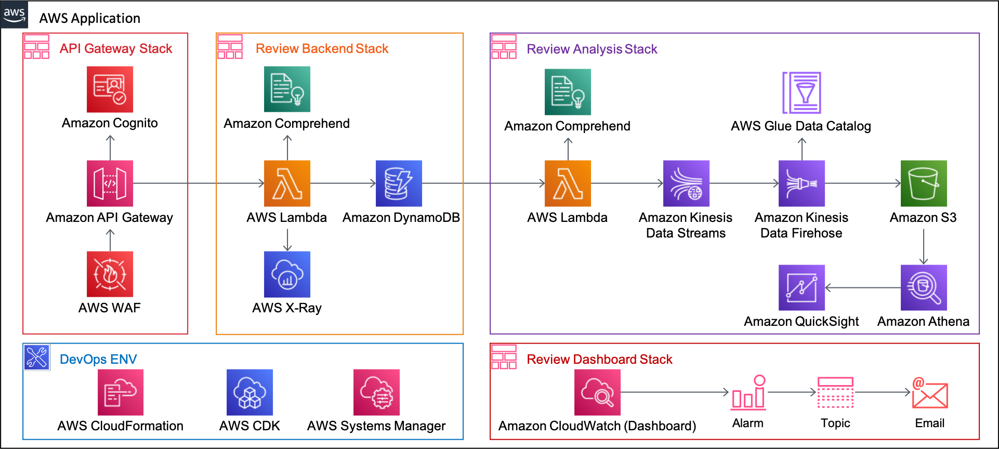

### Project Directory Structure

* config: CDK project configuration json file for each deployment stage
* infra: CDK typescript source codes
* infra/app-main: CDK project main file
* infra/stack: CDK Stack classes
* codes/lambda: python source codes for each lambda function
* script: utility scripts such as setup/deploy/destroy/simulation
* script/simulation: simulation test scripts
* test: test files such as CDK-nag

## Implementation

### IaC - CDK Project

All the resources described above are implemented and provided through AWS CDK ver2. Because this CDK project is built on top of [AWS CDK Project Template for DevOps
](https://github.com/aws-samples/aws-cdk-project-template-for-devops), please refer to that repository for details.

 And other "Using AWS CDK" series can be found at:

* [AWS Serverless Using AWS CDK](https://github.com/aws-samples/aws-serverless-using-aws-cdk)
* [Amazon Cognito and API Gateway based machine to machine authorization using AWS CDK](https://github.com/aws-samples/amazon-cognito-and-api-gateway-based-machine-to-machine-authorization-using-aws-cdk)
* [AWS ECS DevOps using AWS CDK](https://github.com/aws-samples/aws-iot-greengrass-v2-using-aws-cdk](https://github.com/aws-samples/aws-ecs-devops-using-aws-cdk))
* [AWS IoT Greengrass Ver2 using AWS CDK](https://github.com/aws-samples/aws-iot-greengrass-v2-using-aws-cdk)
* [Amazon SageMaker Built-in Algorithms MLOps Pipeline Using AWS CDK](https://github.com/aws-samples/amazon-sagemaker-built-in-algorithms-mlops-pipeline-using-aws-cdk)

### Prerequisites - Installation

First of all, AWS Account and IAM User is required. And then the following modules must be installed.

* AWS CLI: aws configure --profile [profile name]
* Node.js: node --version
* AWS CDK: cdk --version
* jq: jq --version
* curl: curl --version
* python: python3 --version

### Configuration

Open one of configuration json files  in `config` directory, and update Name/Stage/Accouont/Region/Profile in `Project`. `Accouont/Region/Profile` depdends on your AWS Account, and you don't need to change `Name/Stage`. Additionaly, update email address in `Stack/ReviewDashboard/SubscriptionEmails`.

```json
{
    "Project": {
        "Name": "ReviewService",                      <----- Optional: your project name, all stacks will be prefixed with [Project.Name+Project.Stage]
        "Stage": "Dev",                               <----- Optional: your project stage, all stacks will be prefixed with [Project.Name+Project.Stage]
        "Account": "your aws account number",         <----- Essential: update according to your AWS Account
        "Region": "your aws region name",             <----- Essential: update according to your target region
        "Profile": "your aws credential profile name" <----- Essential: AWS Profile, keep empty string if you use `default` profile
    },

    "Stack": {
        ...
        ...
        "ReviewDashboard": {
            "Name": "ReviewDashboardStack",

            "DashboardName": "ReviewDashboard",

            "SubscriptionEmails": ["your email address"], <----- Essential: Alarm notification Emails

            "ApiGatewayOverallCallThreshold": 100,        <----- Optional: Alarm Threshold for Overall Call
            "ApiGatewayError4xxCallThreshold": 20,        <----- Optional: Alarm Threshold for 4XX Error Call
            "ApiGatewayError5xxCallThreshold": 20         <----- Optional: Alarm Threshold for 5XX Error Call
        }
    }
}
```

In this guide, I have chosen `config/app-config-dev.json` file for convenience of explanation.

### Setup AWS CDK Environment

***Caution***: This solution contains not-free tier AWS services. So be careful about the possible costs.

```bash
sh script/setup_initials.sh config/app-config-dev.json
```

### Deploy 4 Stacks

***Caution***: This solution contains not-free tier AWS services. So be careful about the possible costs.

Execute this single script:

```bash
sh script/deploy_stacks.sh config/app-config-dev.json
```

or you can deploy manually like this:

```bash
export AWS_PROFILE=[your profile name]
export APP_CONFIG=config/app-config-dev.json

cdk list

cdk deploy *-ReviewBackendStack
cdk deploy *-ApiGatewayStack --outputs-file script/output/ApiGatewayStack.json
cdk deploy *-ReviewAnalysisStack --outputs-file script/output/ReviewAnalysisStack.json
cdk deploy *-ReviewDashboardStack
```

***Caution***: You must match this order for the first deployment. After that, these Stacks can be deployed independently in any order.

### Deployment Results

This is a deployment result in CloudFormation.

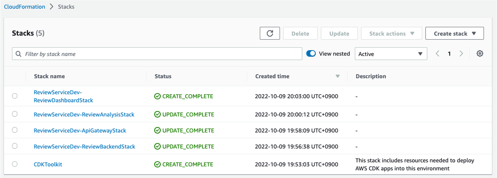

## How to simulate

### Create and confirm a user in Coginto

Execute this single script. This `create_user.sh` script will create a new user and confirm in Cognito.

```bash
sh script/simulation/create_user.sh [aws profile name] [new user id, for example user-01] [new user pw] [cognito user pool id]
```

where
 [cognito user pool id] is `OutputUserPoolId` in `script/output/ApiGatewayStack.json`.

This is Password Policy in Cognito in [api-gateway-stack.ts](infra/stack/api-gateway-stack.ts):

```json
{
    requireSymbols: true,
    minLength: 8,
    requireUppercase: true,
    requireDigits: true
}
```

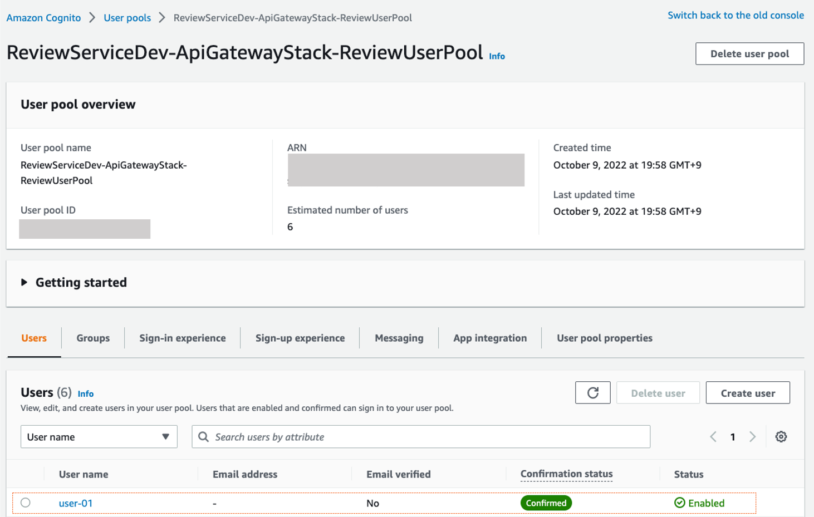

### Request a lot of reviews

Execute this single script. This `request_reviews.py` will log in to get Token and request POST REST API using [Amazon review data - Toy](https://s3.amazonaws.com/amazon-reviews-pds/readme.html).

```bash
python3 script/simulation/request_reviews.py --profile [aws profile name] --url [APIGatewaty URL + /review] --pool [cognito user pool client id] --id [new user id] --pw [new user pw]
```

where
 [APIGatewaty URL] is `OutputRestApiUrl` in `script/output/ApiGatewayStack.json`.
 [cognito user pool client id] is `OutputUserPoolClientId` in `script/output/ApiGatewayStack.json`.

### Monitoring Dashboard

After a while, go to CloudWatch Dashboard. You can check the metrics that new data is coming in.

#### API Gateway Widget

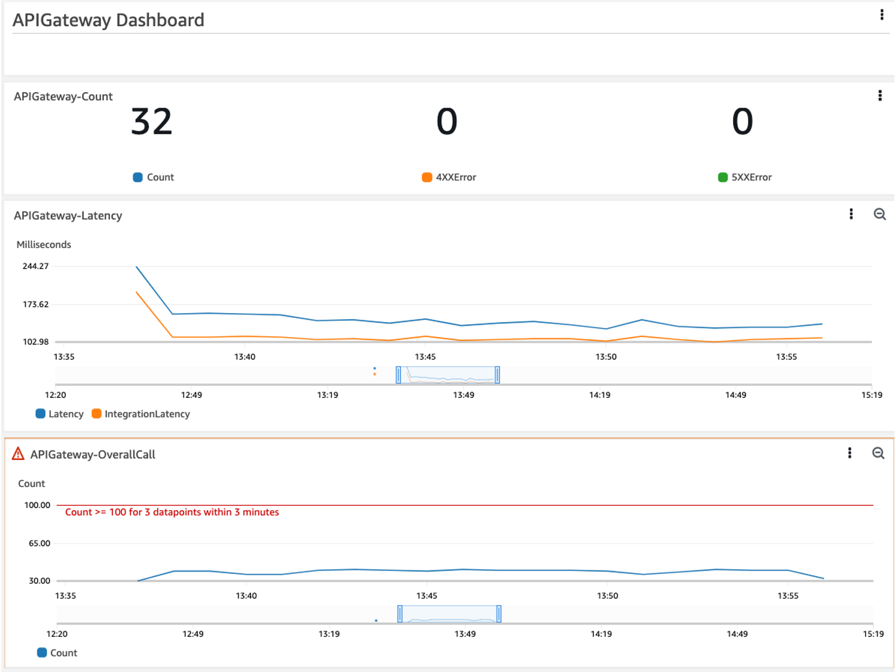

#### Kinesis Widget

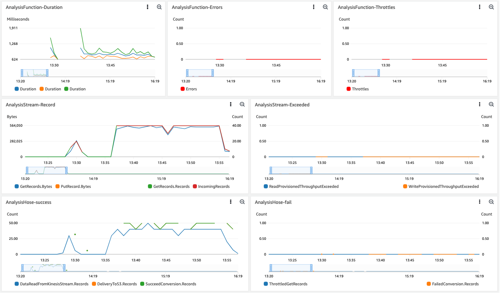

### Athena Queries

Our CDK [ReviewAnalysisStack](infra/stack/review-analysis-stack.ts) deploy `Workgroup` and `pre-defined queries` in Athena. So we can easily execute those queries on demand.

Go to Qthena console, and `Query editor` menu, and then `Saved queries`. After changing `Workgroup`, execute the queries in order(3~7).

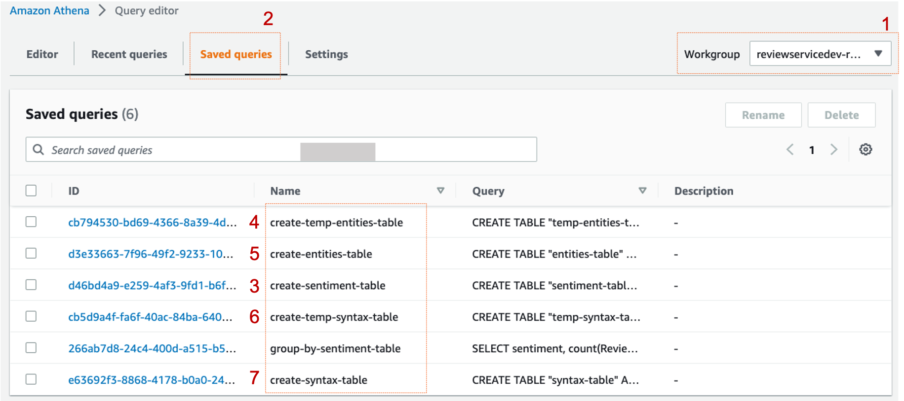

These quries will create the following tables in Athena. We will use sentiment-table/syntax-table/entities-table in QuickSight

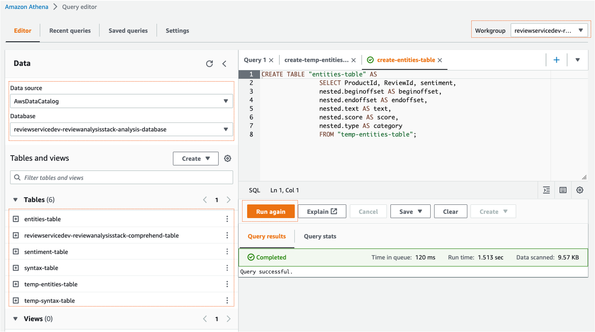

### QuickSight Dashboard

Our CDK [ReviewAnalysisStack](infra/stack/review-analysis-stack.ts) just deploy QuickSight role only for QuickSight. So we have to set up QuickSight's DataSource/Analysis/Dashboard manually.

#### QuickSight Role setting

Go to QuickSight console, and `Manage QuickSigh` menu, and then `Security & permissions`. Please change `QuickSight-managed role(default)` to an `existing role` which CDK created in [ReviewAnalysisStack](infra/stack/review-analysis-stack.ts) for us.

where
 [an existing role] is `OutputQuickSightRole` in `script/output/ReviewAnalysisStack.json`

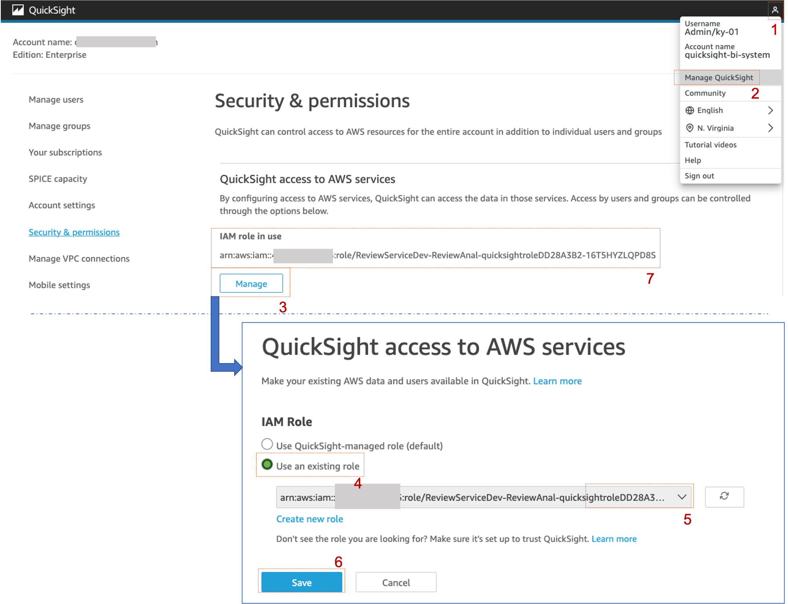

#### QuickSight Analysis

QuickSight Sentiment Analysis
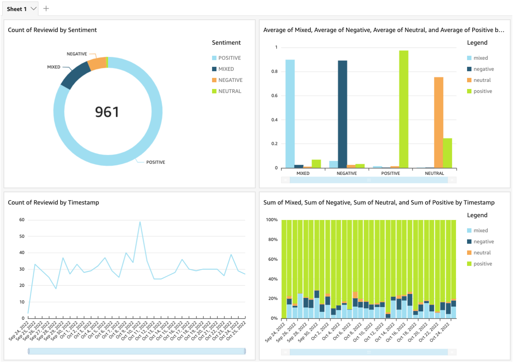

QuickSight Syntax Analysis
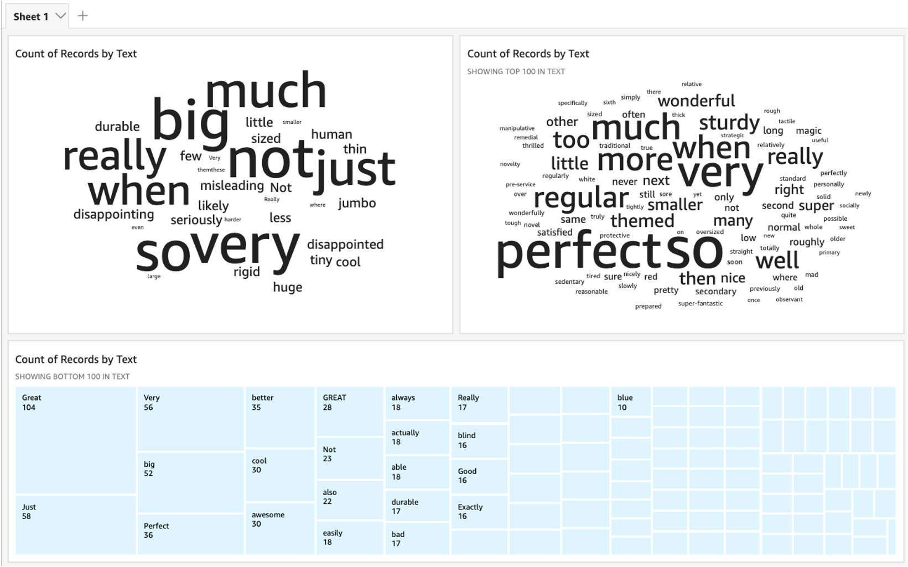

QuickSight Entities Analysis
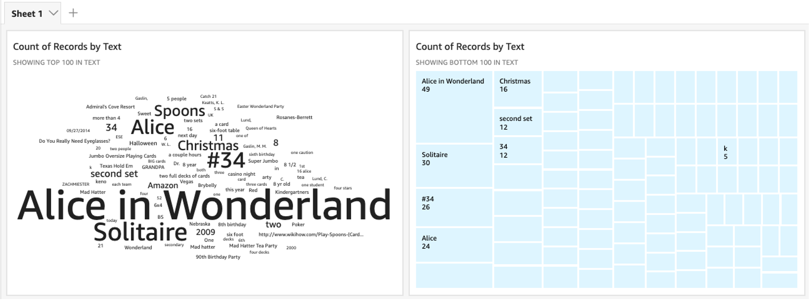

## Clean up

```bash
sh script/destroy_stacks.sh config/app-config-dev.json
```

***Caution***: You must ```delete``` S3/DynamoDB manually because of removal policy.

## Security

See [CONTRIBUTING](CONTRIBUTING.md#security-issue-notifications) for more information.

## License

This library is licensed under the MIT-0 License. See the LICENSE file.
